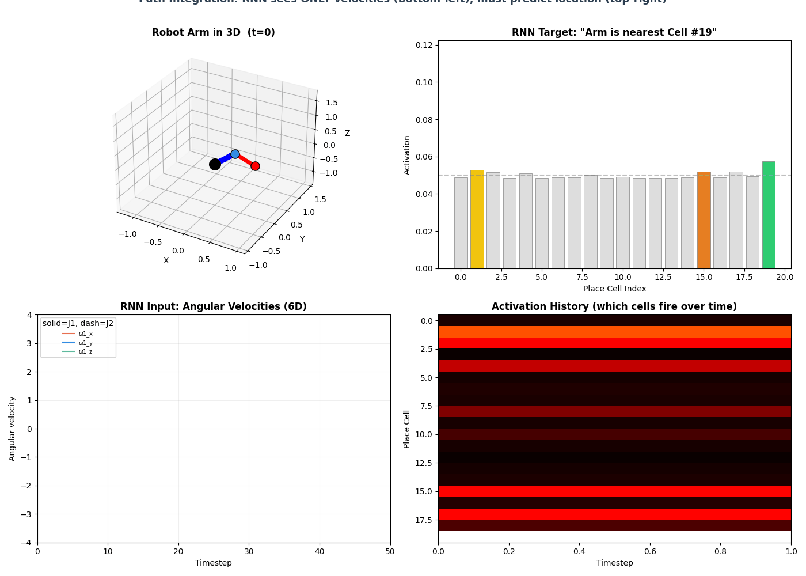
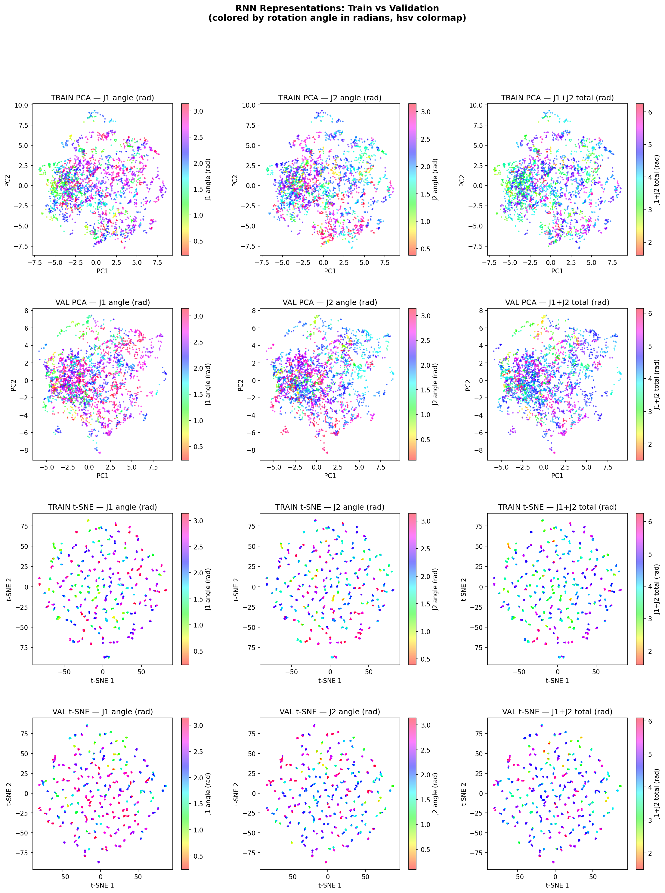
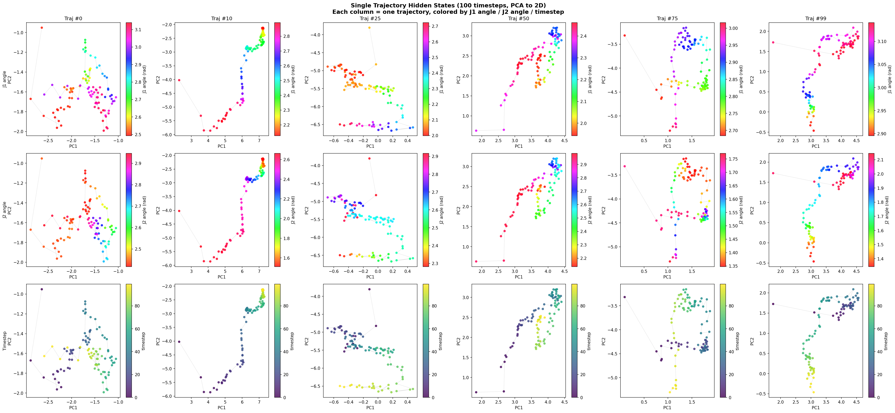
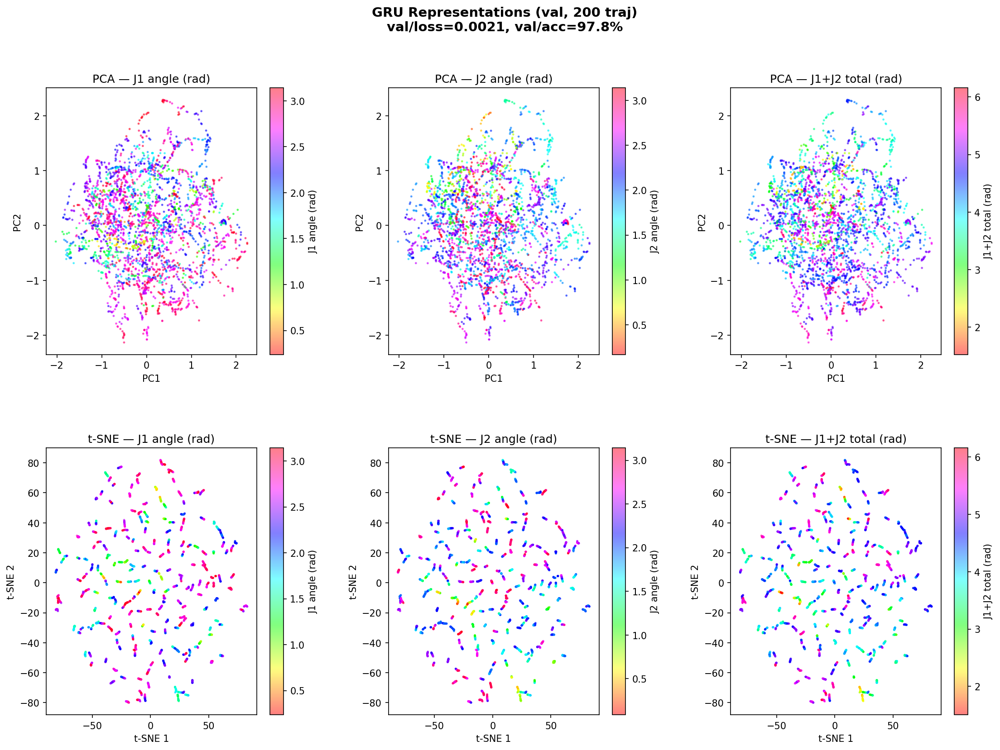
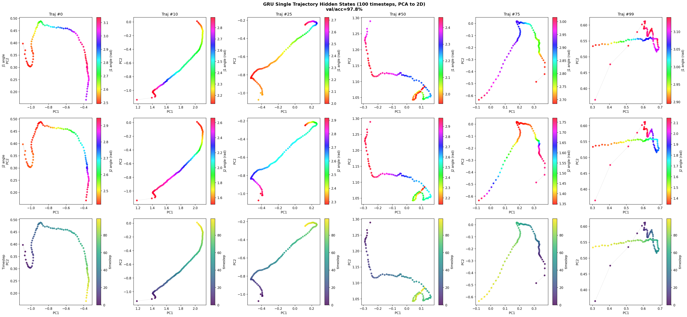

# Estimation Progress: Path Integration on SO(3) x SO(3)

## What We're Doing

We're training an RNN to **track the configuration of a 2-joint robotic arm** purely from angular velocity inputs. Each joint can rotate freely in 3D (the configuration space is SO(3) x SO(3)). The RNN never directly observes the arm's pose — it must learn to internally integrate velocities over time to figure out "where the arm is now."

This is inspired by [Banino et al. 2018 (Nature)](https://www.nature.com/articles/s41586-018-0102-6), where DeepMind trained RNNs on path integration in 2D flat space and found grid-cell-like representations emerging. We're doing the same thing but on the curved rotation manifold SO(3) x SO(3).

### The Pipeline

1. **Generate synthetic trajectories** — Random angular velocities (smooth, via Ornstein-Uhlenbeck process) drive the arm. At each timestep we record the velocity (RNN input) and the current configuration encoded as "place cell" activations (RNN target).
2. **Train the RNN** — The model receives velocities and predicts which place cells should be active. It must internally track the arm's configuration to do this.
3. **Analyze representations** — After training, we look at what the RNN's hidden states encode using PCA, t-SNE, and tuning curves.

<div align="center">
    
</div>

## How We Generate Data

Each training example is a trajectory of the arm moving through SO(3) x SO(3) over 100 timesteps. Here's the process:

1. **Sample a random starting pose** — Both joints initialized to uniformly random 3D rotations on SO(3).

2. **Generate smooth angular velocities** — We use an Ornstein-Uhlenbeck (OU) process, which produces smooth, mean-reverting random velocities (6D: 3 per joint). The OU process has two parameters:
   - `sigma=1.0` — steady-state standard deviation (how fast the joints spin)
   - `theta=2.0` — mean-reversion rate (prevents runaway velocities)

3. **Integrate on the manifold** — At each timestep, we update the joint rotations using the exponential map:
   ```
   R_new = R_old * exp(omega * dt)
   ```
   This is the SO(3) equivalent of `position += velocity * dt` in flat space. The `exp()` converts an angular velocity vector into a rotation matrix via Rodrigues' formula. No boundary handling needed — SO(3) is compact (wraps around).

4. **Compute place cell targets** — At each timestep, we compute the geodesic distance from the current rotation to each of the 32 cell centers (per joint), apply the vMF kernel, and softmax-normalize to get a probability distribution.

The result for each trajectory:
- **Input**: `(100, 6)` — angular velocities at each timestep
- **Target**: `(100, 64)` — place cell probability distributions (32 per joint, concatenated)
- **Initial position**: `(64,)` — place cell activation at the starting pose

We generate 100k training + 5k validation trajectories using 16-32 parallel workers (~5 min). Data saved as a single `.pt` file (~2.8 GB).

## Place Cells on SO(3)

Place cells are reference points scattered on the rotation manifold. For a given arm configuration, each cell "fires" proportionally to how close the arm is to that cell's preferred orientation. The output is a probability distribution over cells — the model is trained with **KL divergence loss** between predicted and true distributions.

### Von Mises-Fisher Kernel (Key Design Choice)

We initially tried Gaussian RBF (the standard choice in flat space):

```
activation = exp(-distance^2 / (2 * sigma^2))
```

**This completely fails on SO(3).** Because geodesic distances on SO(3) are bounded (max = pi ~ 3.14), all distances cluster tightly and the softmax-normalized output becomes nearly uniform regardless of sigma. The RNN gets no useful training signal.

The fix: **von Mises-Fisher (vMF) kernel**, the natural analogue of Gaussian on rotation groups:

```
activation = softmax(kappa * cos(distance))
```

With `kappa=5` and 32 cells per joint, this produces properly peaked distributions (~4-5 effective cells per joint). The training signal is strong and the RNN converges.

### Per-Joint Factorization

Instead of placing cells on the full 6D product space SO(3) x SO(3) (intractable), we use **32 cells per joint independently**. Each joint has its own softmax distribution. The model outputs 64 values: two concatenated 32-dim probability vectors. The loss (KL divergence) is computed separately per joint and averaged.

## Training Results

All models: hidden_size=256, dropout=0.5, cosine annealing LR, 200 epochs, 100k training trajectories.

| Model | Best Val Loss | Best Val Accuracy | Random Chance |
|-------|--------------|-------------------|---------------|
| RNN   | 0.3049       | 68.9%             | 3.1% (1/32)   |
| GRU   | 0.0021       | 97.8%             | 3.1% (1/32)   |

The GRU dramatically outperforms the vanilla RNN — nearly perfect prediction of which place cell should be active at each timestep.

## Representation Analysis

We extract the 256-dim hidden states from each model, project them to 2D (PCA or t-SNE), and color by the true rotation angle (in radians) at each timestep. This reveals how the network organizes its internal representation of arm configuration.

### RNN — Aggregated View (200 trajectories)

20,000 points (200 trajectories x 100 timesteps), each colored by true joint rotation angle:



Train and validation show similar patterns — no data leakage, consistent behavior. Mild organization but no dramatic geometric structure.

### RNN — Single Trajectory View

The structure becomes clearer when looking at individual trajectories. Each traces a smooth path through hidden space:



### GRU — Aggregated View

Same analysis for the GRU (97.8% accuracy):



### GRU — Single Trajectory View

Individual GRU trajectories show clearer color gradients along the paths compared to RNN — the higher accuracy translates into more structured hidden representations:



### Interpretation

Both models build **local, trajectory-coherent** representations — within a single trajectory, nearby timesteps map to nearby hidden states, and rotation angles vary smoothly along the path. The GRU's trajectories show sharper structure, consistent with its much higher accuracy.

The **global** structure (across trajectories starting from different poses) is less organized in both models. The representations are functional for path integration but haven't yet formed a clean global map of SO(3) — this may require longer training, different regularization, or Fourier analysis to detect periodic structure.

## How to Get Started

### 1. Generate Data

```bash
python scripts/generate_data.py --n_train 100000 --n_val 5000 --workers 16
```

This creates `data/estimation/trajectories.pt` (~2.8 GB). Takes ~5 minutes with 16 workers.

### 2. Train

```bash
bash scripts/train.sh rnn 0    # train RNN on GPU 0
bash scripts/train.sh gru 0    # train GRU on GPU 0
bash scripts/train.sh lstm 0   # train LSTM on GPU 0
```

Or directly:

```bash
python scripts/train.py --config articulated/configs/estimation/rnn.yaml
```

Checkpoints saved to `logs/estimation/<model_type>/checkpoints/`. Logs to WandB (if configured) and CSV.

### 3. Analyze Representations

```bash
PYTHONPATH=. python scripts/analyze_representation.py logs/estimation/rnn/checkpoints/best.ckpt
```

Generates PCA, t-SNE, and tuning curve plots saved next to the checkpoint.

### 4. Use Trained Model for Predictions

```python
from articulated.estimation.model import StateEstimationModel

# Load trained model
model = StateEstimationModel.load_from_checkpoint("logs/estimation/rnn/checkpoints/best.ckpt")
model.eval()

# Predict place cell activations from velocities
# velocities: (batch, seq_len, 6) — angular velocities
# init_pc: (batch, 64) — initial place cell activation
logits, hidden_states = model(velocities, hidden=model._encode_init_pos(init_pc))

# Get embedding for downstream RL
embedding = model.get_embedding(velocities)  # (batch, 256)

# Get full hidden state trajectory for analysis
hidden = model.get_hidden_states(velocities)  # (batch, seq_len, 256)
```

## Next Steps

- **Try GRU/LSTM** — May produce sharper representations than vanilla RNN
- **Longer training** — Banino et al. trained significantly longer; 200 epochs may not be enough for global structure
- **Regularization sweep** — Vary dropout, weight decay
- **Look for grid-like patterns** — Fourier analysis of hidden states, spatial autocorrelation on SO(3)
